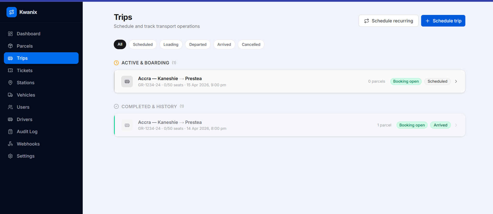
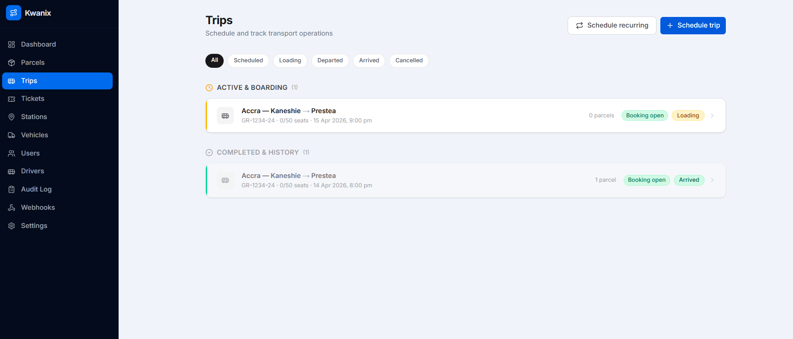
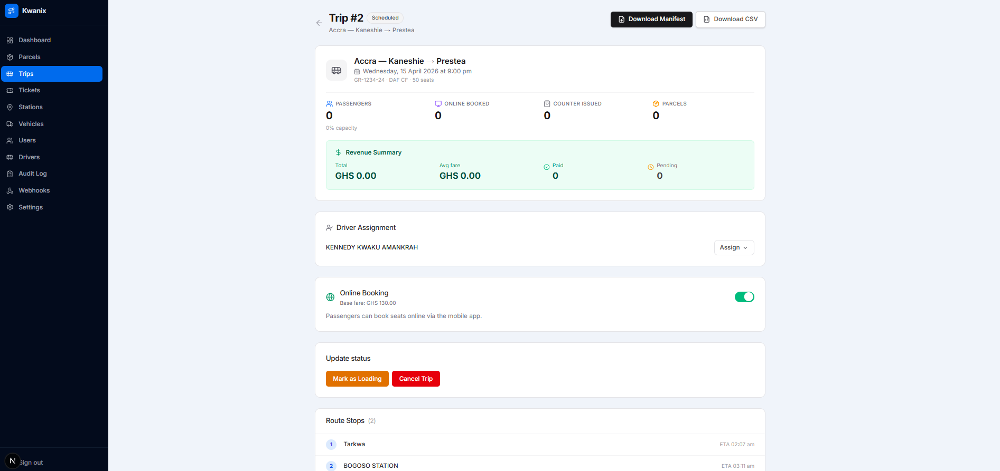
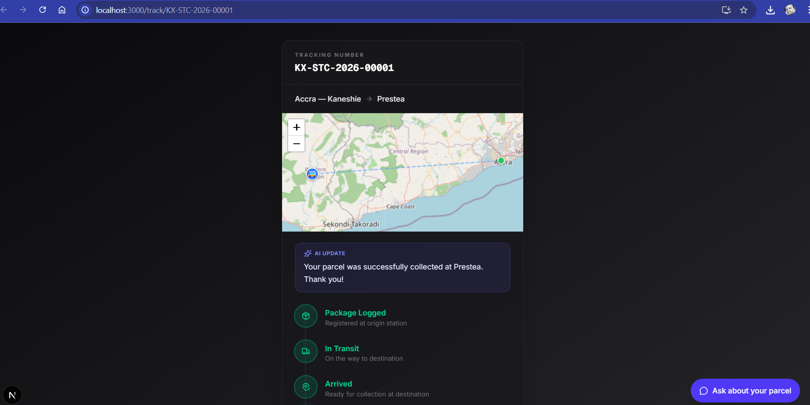
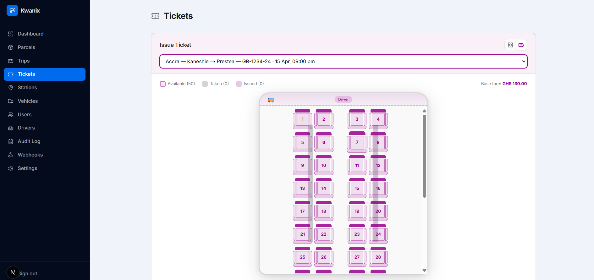
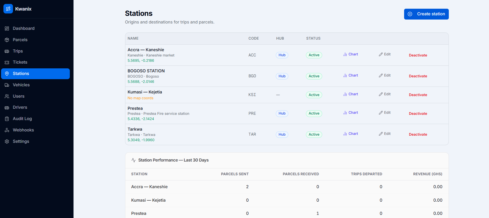

# Kwanix

**Kwanix** is a multi-tenant SaaS platform for transit management in Ghana — combining ticketing, parcel logistics, fleet tracking, and billing in a single system.

---

## Screenshots

> Add screenshots to a `docs/screenshots/` folder and update the paths below.

| Dashboard | Trips |
|-----------|-------|
|  |  |

| Trip Detail | Parcel Tracking |
|-------------|-----------------|
|  |  |

| Ticket | Stations |
|--------|----------|
|  |  |

---

## Table of Contents

- [Overview](#overview)
- [Tech Stack](#tech-stack)
- [Architecture](#architecture)
- [Features](#features)
- [Roles & Permissions](#roles--permissions)
- [Getting Started](#getting-started)
- [Environment Variables](#environment-variables)
- [Database Migrations](#database-migrations)
- [Seed Data](#seed-data)
- [API Reference](#api-reference)
- [Project Structure](#project-structure)

---

## Overview

Kwanix is built for inter-city bus companies. It handles the full operational loop:

1. **Schedule trips** → assign vehicles and drivers  
2. **Sell tickets** at the counter or let passengers book online  
3. **Log parcels** with tracking numbers, weight-based pricing, and OTP pickup verification  
4. **Track vehicles** in real time via GPS coordinates on an interactive map  
5. **Monitor revenue** with per-trip manifests, CSV exports, and a 7-day activity chart  
6. **Manage the platform** as a super admin across multiple tenant companies

---

## Tech Stack

| Layer | Technology |
|-------|-----------|
| Backend API | FastAPI (Python 3.11), async, Pydantic v2 |
| Database | PostgreSQL 16 with Row-Level Security (RLS) |
| ORM | SQLAlchemy 2.0 async |
| Auth | JWT (access + refresh tokens), cookie-based sessions |
| Task queue | Redis |
| Frontend | Next.js 16 (App Router), React 19, TypeScript |
| Styling | Tailwind CSS, shadcn/ui |
| State | TanStack Query (React Query) |
| Maps | Interactive map via Leaflet (station picker + vehicle GPS) |
| PDF generation | ReportLab |
| SMS | Arkesel SMS gateway |
| Payments | Paystack |
| Containerisation | Docker + Docker Compose |
| Monorepo | `apps/api/` + `apps/web/` |

---

## Architecture

```
┌─────────────────────────────────────────────────────────┐
│                       Browser                           │
│          Next.js 16 App Router (localhost:3000)         │
│   Server Components ──► apiFetch (API_INTERNAL_URL)     │
│   Client Components ──► clientFetch → /api/proxy/*      │
└───────────────────┬─────────────────────────────────────┘
                    │ HTTP (internal Docker network)
┌───────────────────▼─────────────────────────────────────┐
│         FastAPI  (api:8000 / localhost:8000)             │
│  ┌──────────────────────────────────────────────────┐   │
│  │  Routers: auth · trips · tickets · parcels ·     │   │
│  │           stations · vehicles · admin · tracking │   │
│  └──────────────────────┬───────────────────────────┘   │
│                         │                               │
│  ┌──────────────────────▼───────────────────────────┐   │
│  │  PostgreSQL 16  (RLS per company_id)             │   │
│  └──────────────────────────────────────────────────┘   │
│  ┌──────────────────────────────────────────────────┐   │
│  │  Redis  (task queue / caching)                   │   │
│  └──────────────────────────────────────────────────┘   │
└─────────────────────────────────────────────────────────┘
```

### Multi-tenancy via Row-Level Security

Every authenticated request sets `app.current_company_id` as a PostgreSQL session variable. RLS policies on all domain tables automatically restrict queries to that company's data. The `super_admin` role bypasses RLS to see all tenants.

---

## Features

### Dashboard

- **Operational view** (company admin / station clerk) — total trips, active trips, scheduled departures, tickets issued, trip status breakdown, 7-day activity bar chart (tickets + parcels)
- **Platform view** (super admin) — total companies, active trips across all tenants, parcels today, revenue today

### Trips

- Schedule a new trip — vehicle, departure station, destination, date, time, base fare, online booking toggle
- **Route stops** — add ordered intermediate stops with optional ETA per stop
- **Recurring schedule** — generate N daily trips (up to 30 days ahead) with the same stops applied to every trip in the batch
- Auto-assign driver from the vehicle's default driver on creation
- Trip status lifecycle: `scheduled → loading → departed → arrived → cancelled`
- Per-trip detail: passenger stats, revenue summary, route stops, driver assignment, booking toggle
- Download PDF manifest or CSV passenger manifest
- Bulk cancel tickets

### Tickets

- Issue counter tickets with seat picker (visual seat map)
- Online booking (passengers book via public URL, payment via Paystack)
- QR code generation and print
- Ticket status: `active → used / cancelled / refunded`
- Share ticket link with passenger

### Parcels

- Create parcel with sender/receiver, weight, declared value, origin/destination stations
- Weight-based fee calculation with configurable tiers
- Status lifecycle: `pending → in_transit → arrived → picked_up`
- OTP verification on pickup — system sends a 6-digit OTP via SMS to receiver
- Public parcel tracking page (no auth required) with real-time status and interactive map
- In-app AI chat on the tracking page for parcel enquiries
- PDF collection receipt generation
- Parcel return flow with reason logging

### Stations

- Manage company stations with city, address, contact number
- Mark stations as hub
- Pick station coordinates on an interactive map (Leaflet)
- Station coordinates used for GPS-based parcel route visualisation

### Vehicles

- Register vehicles with plate number, model, seating capacity
- Assign a **default driver** to a vehicle (auto-populates trip driver on creation)
- Mark vehicles available/unavailable
- Real-time GPS tracking — latitude/longitude updated by driver app
- Maintenance log (immutable audit trail)

### Drivers

- Manage users with the `driver` role
- Assign driver to a trip manually or via vehicle default driver
- Driver dashboard — view assigned trips, scan QR tickets on boarding

### Users

- Roles: `super_admin`, `company_admin`, `station_manager`, `station_clerk`, `driver`
- Create/deactivate users per company
- Change password, SMS opt-out preference

### Settings (per company)

- Brand colour (applied to PDF manifests)
- Base parcel weight tiers (price per kg bracket)
- Max parcel weight limit
- SLA threshold (days for parcel delivery SLA)
- SMS credits balance
- Paystack billing — subscription plans, billing cycle, invoice history
- API key management
- Webhook events log

### Super Admin

- Manage all companies (create, view, billing override)
- View all users across tenants
- Subscription plan management
- Audit log

---

## Roles & Permissions

| Role | Access |
|------|--------|
| `super_admin` | Full platform access, bypasses RLS, manages all companies |
| `company_admin` | Full access within own company, billing, settings |
| `station_manager` | Trips, tickets, parcels, vehicles, stations within company |
| `station_clerk` | Issue/scan tickets, create parcels, view trips |
| `driver` | View own assigned trips, scan passenger tickets |

---

## Getting Started

### Prerequisites

- Docker & Docker Compose
- Node.js 20+ and npm (for the web frontend)
- Copy `.env.example` to `.env` (or use `.env.dev` for development):

```bash
cp .env.example .env
# Edit .env with your values
```

### Start the backend

```bash
make up          # Start Postgres, Redis, and API container
make migrate     # Run all pending Alembic migrations
make seed        # Load demo data (company, stations, users, vehicle)
```

### Start the frontend

```bash
cd apps/web
npm install
npm run dev      # Next.js dev server → http://localhost:3000
```

### Rebuild after dependency changes

```bash
make rebuild     # Force rebuild without cache + restart API
```

---

## Environment Variables

All variables are documented in `.env.example`. Key variables:

| Variable | Description |
|----------|-------------|
| `DATABASE_URL` | Async PostgreSQL connection string (used by API) |
| `DATABASE_ADMIN_URL` | Admin connection string (RLS bypass, used by Alembic) |
| `JWT_SECRET_KEY` | Secret for signing JWT tokens |
| `SESSION_SECRET` | Secret for encrypting Next.js session cookies |
| `API_INTERNAL_URL` | Internal Docker URL for Next.js → API calls (e.g. `http://api:8000`) |
| `NEXT_PUBLIC_API_URL` | Public-facing API URL for browser → API calls (e.g. `http://localhost:8000`) |
| `NEXT_PUBLIC_APP_URL` | Public app URL (e.g. `http://localhost:3000`) |
| `ARKESEL_API_KEY` | SMS gateway key (Arkesel) |
| `ARKESEL_SENDER_ID` | SMS sender name |
| `PAYSTACK_SECRET_KEY` | Paystack secret key for payments |
| `PAYSTACK_PUBLIC_KEY` | Paystack public key (embedded in frontend) |
| `RESEND_API_KEY` | Email service key (manifest emails) |
| `GEMINI_API_KEY` | Google Gemini key (parcel tracking AI chat) |
| `SENTRY_DSN` | Sentry DSN for API error monitoring |
| `NEXT_PUBLIC_SENTRY_DSN` | Sentry DSN for frontend error monitoring |

---

## Database Migrations

```bash
make migrate                     # Apply all pending migrations
make migrate-down                # Rollback one step
make revision MSG="description"  # Generate a new migration file
```

Migrations live in `apps/api/alembic/versions/`. Always generate via `make revision` — never write migration files by hand.

---

## Seed Data

After `make seed`:

| Role | Email | Password |
|------|-------|----------|
| `super_admin` | admin@Kwanix.com | admin123 |
| `company_admin` | stcadmin@stc.com | admin123 |
| `station_clerk` | clerk@accra.stc.com | clerk123 |

**Company:** STC  
**Stations:** Accra (hub), Kumasi, Prestea  
**Vehicle:** GR-1234-24 (DAF CF, 50 seats)

---

## API Reference

The FastAPI app auto-generates interactive docs:

- **Swagger UI:** [http://localhost:8000/docs](http://localhost:8000/docs)
- **ReDoc:** [http://localhost:8000/redoc](http://localhost:8000/redoc)

### Key endpoint groups

| Prefix | Description |
|--------|-------------|
| `POST /api/v1/auth/login` | OAuth2 password flow, returns JWT |
| `POST /api/v1/auth/refresh` | Refresh access token |
| `GET/POST /api/v1/trips` | List and create trips |
| `POST /api/v1/trips/generate-schedule` | Bulk-create recurring trips |
| `GET /api/v1/trips/{id}/manifest` | Download PDF manifest |
| `GET /api/v1/trips/{id}/stops` | List route stops |
| `POST /api/v1/trips/{id}/stops` | Add a route stop |
| `GET/POST /api/v1/tickets` | List and issue tickets |
| `GET/POST /api/v1/parcels` | List and create parcels |
| `PATCH /api/v1/parcels/{id}/status` | Update parcel status |
| `POST /api/v1/parcels/{id}/verify-otp` | Verify pickup OTP |
| `GET /api/v1/parcels/track/{tracking_number}` | Public tracking (no auth) |
| `GET/POST /api/v1/stations` | Manage stations |
| `GET/POST /api/v1/vehicles` | Manage vehicles |
| `PATCH /api/v1/vehicles/{id}/gps` | Update vehicle GPS coordinates |
| `GET /api/v1/admin/companies` | Super admin: list all companies |
| `GET /api/v1/admin/stats` | Super admin: platform metrics |
| `GET /api/v1/billing/status` | Company billing/subscription status |

### Generate TypeScript types (API must be running)

```bash
bash infrastructure/scripts/generate_types.sh
# Output: apps/web/types/api.generated.ts
```

---

## Project Structure

```
Kwanix/
├── apps/
│   ├── api/                        # FastAPI backend
│   │   ├── app/
│   │   │   ├── models/             # SQLAlchemy ORM models
│   │   │   ├── schemas/            # Pydantic request/response schemas
│   │   │   ├── routers/            # Route handlers (one file per domain)
│   │   │   ├── services/           # Business logic
│   │   │   ├── dependencies/       # Auth, DB session, role guards
│   │   │   ├── integrations/       # Arkesel SMS, Paystack, email
│   │   │   └── utils/              # PDF generation, QR codes, phone parsing
│   │   ├── alembic/versions/       # Database migrations
│   │   └── tests/                  # pytest test suite
│   │
│   └── web/                        # Next.js 16 frontend
│       ├── app/
│       │   ├── (auth)/             # Login page (public)
│       │   ├── (dashboard)/        # Protected dashboard pages
│       │   │   ├── dashboard/      # Overview stats
│       │   │   ├── trips/          # Trip list + detail
│       │   │   ├── tickets/        # Ticket management
│       │   │   ├── parcels/        # Parcel logistics
│       │   │   ├── stations/       # Station management
│       │   │   ├── vehicles/       # Fleet management
│       │   │   ├── drivers/        # Driver management
│       │   │   ├── users/          # User management
│       │   │   ├── companies/      # Super admin: companies
│       │   │   ├── settings/       # Company settings + billing
│       │   │   └── audit/          # Audit log
│       │   ├── (driver)/           # Driver-only views
│       │   ├── track/[id]/         # Public parcel tracking
│       │   └── api/                # Next.js API routes (proxy, manifest, etc.)
│       ├── components/             # Shared UI components
│       ├── hooks/                  # React Query hooks
│       └── lib/                    # Session, apiFetch, client-fetch helpers
│
├── infrastructure/
│   └── scripts/                    # deploy.sh, generate_types.sh
├── docker-compose.yml              # Development
├── docker-compose.staging.yml
├── docker-compose.prod.yml
├── Makefile                        # Developer shortcuts
└── .env.example                    # Environment variable template
```

---

## Development Commands

```bash
# Backend
make up              # Start all containers
make test            # Fast tests (SQLite in-memory)
make test-postgres   # RLS isolation tests (requires live Postgres)
make test-all        # Both suites
make test-cov        # Coverage report (apps/api/htmlcov/index.html)
make lint            # ruff check (read-only)
make lint-fix        # ruff check --fix + ruff format
make typecheck       # mypy static analysis
make shell           # Bash inside API container
make db-shell        # psql shell
make logs            # All service logs
make api-logs        # API logs only

# Frontend
cd apps/web
npm run dev          # Dev server → localhost:3000
npm run build        # Production build
npm run lint         # ESLint
```

---

## Parcel Lifecycle

```
pending → in_transit → arrived → picked_up
                    ↘ returned (with reason)
```

- **pending** — parcel registered, awaiting loading onto a trip
- **in_transit** — loaded onto a departing trip
- **arrived** — trip arrived at destination station
- **picked_up** — receiver verified identity via SMS OTP
- **returned** — parcel sent back to origin with reason

---

## Trip Lifecycle

```
scheduled → loading → departed → arrived
         ↘           ↘          ↘
          cancelled   cancelled  cancelled
```

---

## License

Private — all rights reserved.
